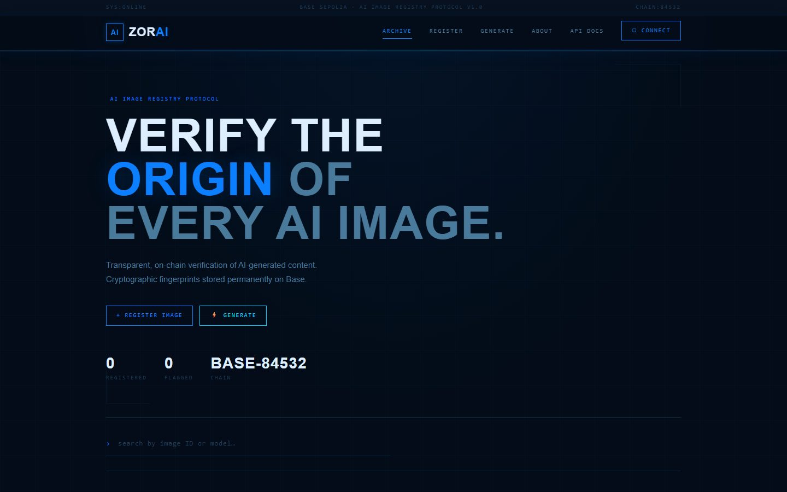

# ZorAI

[](https://github.com/jvitorbarros15/zorai/actions/workflows/ci.yml)

Decentralized provenance registry for AI-generated images, combining content analysis, IPFS metadata, and an on-chain record on Base Sepolia.

[Live demo](https://zorai.vercel.app) · [Portfolio](https://joao-vitor-barros-da-silva-portfoli.vercel.app) · [Contract on BaseScan](https://sepolia.basescan.org/address/0x30066d398E5947dBa29E84d0eaB2aaCeB3946341)



## What it demonstrates

- A complete web3 workflow spanning Next.js, API routes, Solidity, IPFS, and wallet interaction
- Deterministic image identifiers used to register and verify provenance
- Structured AI risk analysis stored alongside durable public records
- Server-side signing protected by an API key, with client wallet support through MetaMask
- Contract compilation and deployment tooling with Hardhat

## How it works

```text
Image -> content analysis -> metadata on IPFS -> hash registered on Base Sepolia
                                                    |
Verification request -------------------------------+
```

## Stack

Next.js 14, React 18, Tailwind CSS, Solidity, Hardhat, ethers.js, Pinata/IPFS, OpenAI, Anthropic, and MetaMask.

## Deployed contract

| Field | Value |
| --- | --- |
| Contract | `ZorAiRegistry` |
| Network | Base Sepolia |
| Chain ID | `84532` |
| Address | `0x30066d398E5947dBa29E84d0eaB2aaCeB3946341` |

Core methods are `registerImage`, `getImageData`, and `isImageRegistered`.

## Run locally

Requirements: Node.js 20+, a Base Sepolia RPC endpoint, and a dedicated test wallet.

```bash
npm install
cp .env.example .env
npm run dev
```

Required configuration varies by workflow:

```text
NEXT_PUBLIC_CONTRACT_ADDRESS
ZORAI_RPC_URL
ZORAI_API_KEY
ZORAI_SIGNER_PRIVATE_KEY   # server-side registration only
PRIVATE_KEY               # Hardhat deployment only
```

Never expose private keys through `NEXT_PUBLIC_` variables or use a wallet that holds real funds.

## Contract workflow

```bash
npx hardhat compile
npx hardhat run scripts/deploy.js --network baseSepolia
```

## API

- `POST /api/register` writes a new record using the configured server signer and `x-api-key` header.
- `GET /api/verify` reads provenance data from the registry contract.

Registration accepts an image hash, model name, IPFS CID, risk level, and risk reasons. Optional metadata includes company, external ID, source URL, and content type.

## Project structure

```text
components/        Reusable React components
contracts/         Solidity source and ABI files
lib/               Blockchain and registry helpers
pages/api/         Registration and verification routes
scripts/           Hardhat deployment scripts
docs/preview.jpg   Recruiter-facing product preview
```

ZorAI records provenance claims; it does not prove that every unregistered image is authentic.
